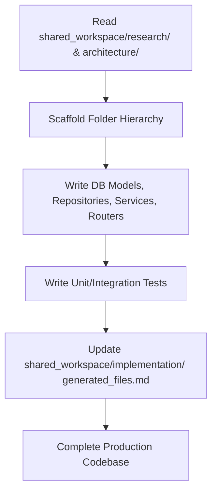

# Workflow: Implementation Engineer

The Implementation Engineer Agent runs as the final implementation stage in the pipeline:

## Step 1: Read Workspace
* Retrieve all research and design instructions.

## Step 2: Set Up File System Structure
* Execute directory shell setup.

## Step 3: Implement Database & Models
* Write data structure scripts.

## Step 4: Implement Service layer
* Write services, utilities, and helper functions.

## Step 5: Implement Routing & Controllers
* Write the API routers, security checks, and controllers.

## Step 6: Log Execution
* Update the files in `shared_workspace/implementation/` following templates exactly.
