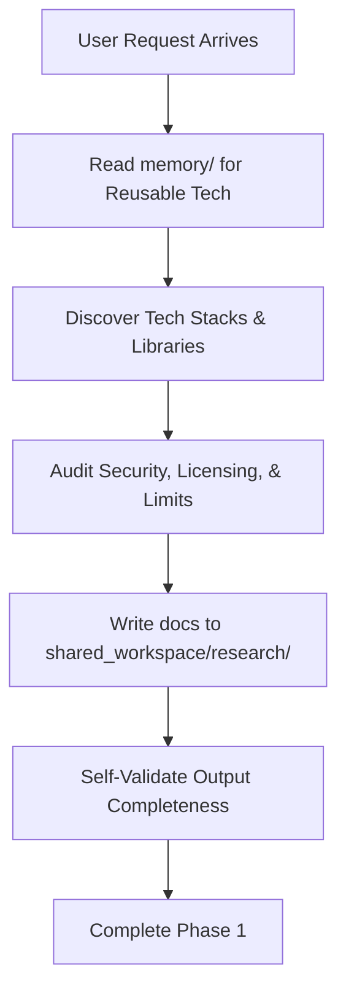

# Workflow: Research Agent

The Research & Intelligence Agent runs as the first stage in the pipeline:

## Step 1: Request Deconstruction
* Break the user request into technical domains: Authentication, Database, Frontend, Core Engine, Background Jobs.

## Step 2: Historical Memory Retrieval
* Inspect `memory/previous_research/` and `memory/architecture_patterns/` to see if a similar stack has already been analyzed. Avoid duplicate research.

## Step 3: Targeted Search & Filtering
* Query API catalogs, NPM, PyPI, and documentation.
* Retrieve security advisory statuses.

## Step 4: Write Research Workspace
* Populate files in `shared_workspace/research/` following templates exactly.

## Step 5: Gatekeeper Validation
* Check that all files contain substantial, actionable content.
* Trigger pipeline transition token to signal Solution Architect.
