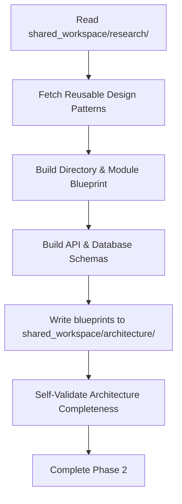

# Workflow: Solution Architect

The Solution Architect Agent runs as the second stage in the pipeline:

## Step 1: Read Research Package
* Read all research documents to identify the technologies chosen and constraints noted.

## Step 2: Directory & Modularity Definition
* Build the directory blueprint.
* Map files to specific framework architectures.

## Step 3: Schema & Endpoint Specification
* Output database DDL statements or Document definitions.
* Define all API endpoints.

## Step 4: Write Architecture Workspace
* Populate files in `shared_workspace/architecture/` following templates exactly.

## Step 5: Transition Gate
* Ensure all files contain robust architectural descriptions.
* Emit pipeline token to signal Implementation Engineer.
