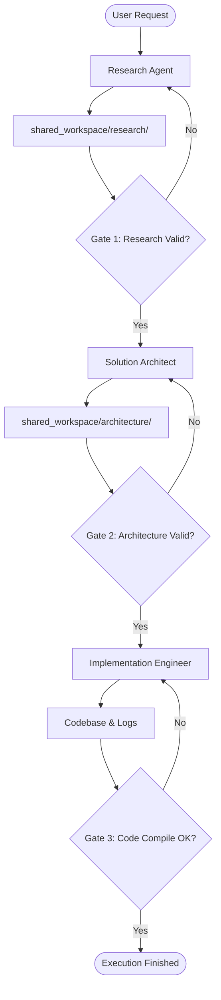

# Execution Graph: Orchestrator Engine

Here is the modular loop network representing runtime paths:

```mermaid
graph TD
    UserRequest([User Request]) --> ResAgent[Research Agent]
    ResAgent --> ResPackage[shared_workspace/research/]
    ResPackage --> Gate1{Gate 1: Research Valid?}
    
    Gate1 -- Yes --> ArchAgent[Solution Architect]
    Gate1 -- No --> ResAgent
    
    ArchAgent --> ArchPackage[shared_workspace/architecture/]
    ArchPackage --> Gate2{Gate 2: Architecture Valid?}
    
    Gate2 -- Yes --> EngAgent[Implementation Engineer]
    Gate2 -- No --> ArchAgent
    
    EngAgent --> Output[Codebase & Logs]
    Output --> Gate3{Gate 3: Code Compile OK?}
    Gate3 -- Yes --> Done([Execution Finished])
    Gate3 -- No --> EngAgent
```
