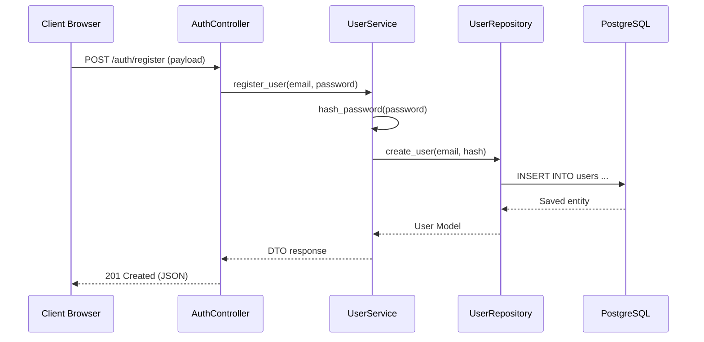

# Data Flow & Execution Diagrams

Sequencing of operations across stack layers.

---

## 🔄 User Registration Flow Diagram

```mermaid
sequenceDiagram
    participant User as Client Browser
    participant Controller as AuthController
    participant Service as UserService
    participant Repo as UserRepository
    participant DB as PostgreSQL

    User->>Controller: POST /auth/register (payload)
    Controller->>Service: register_user(email, password)
    Service->>Service: hash_password(password)
    Service->>Repo: create_user(email, hash)
    Repo->>DB: INSERT INTO users ...
    DB-->>Repo: Saved entity
    Repo-->>Service: User Model
    Service-->>Controller: DTO response
    Controller-->>User: 201 Created (JSON)
```
