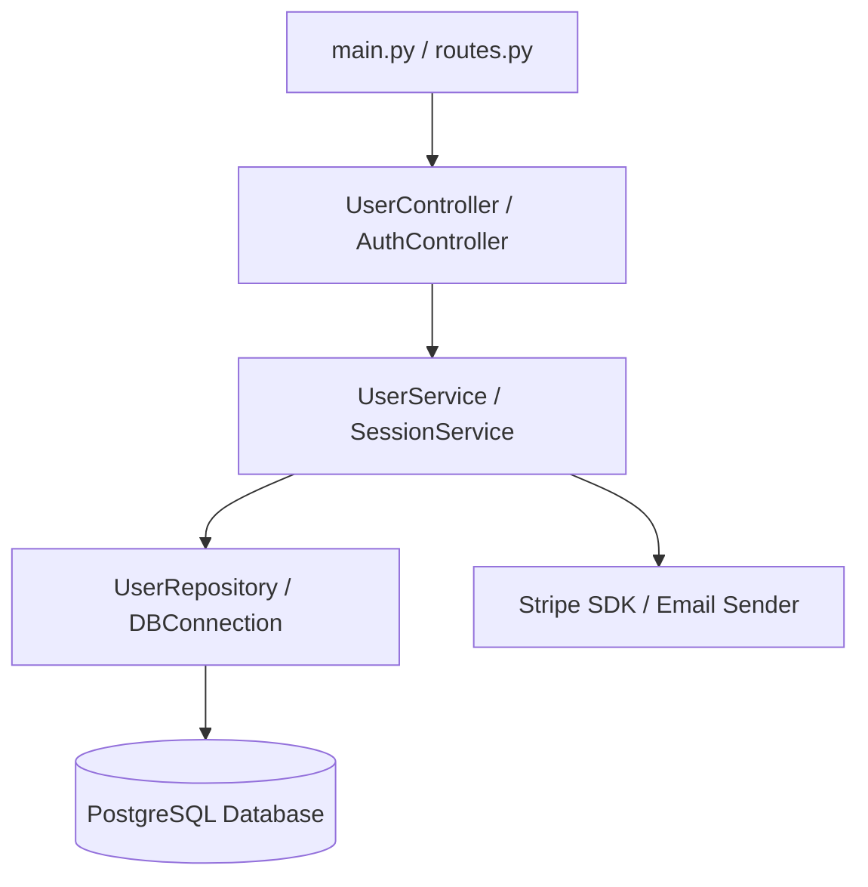

# System Dependency & Component Graph

This file charts dependencies between source classes.

---

## 🕸️ Component Graph

```mermaid
graph TD
    Routes[main.py / routes.py] --> Controller[UserController / AuthController]
    Controller --> Services[UserService / SessionService]
    Services --> Repository[UserRepository / DBConnection]
    Services --> ExternalSDK[Stripe SDK / Email Sender]
    Repository --> DB[(PostgreSQL Database)]
```
